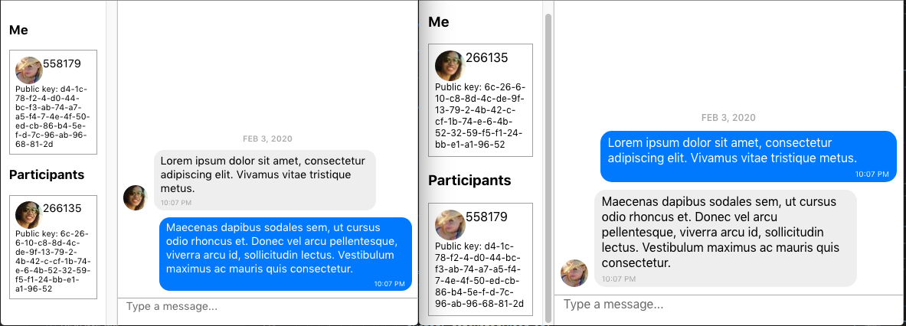

# Example of end-to-end encrypted chat with PubNub, React, Gifted Chat and tweetnacl.

This is an example of chat with messages are encrypted using public/private key pair with `tweetnacl` library and transported via PubNub. UI is build with React and Gifted Chat library.

The messages are sent encrypted and can only be read by recepients. They are safe to store on the server side without a risk of being decryped even if the server is hacked. The decryption key is only known to the recepient and stored locally in the browser.

## Demo

https://alexkorep.github.io/e2e-encrypt-chat/

## Running locally

In the project directory, you can run:

`yarn start`

Runs the app in the development mode.

Open [http://localhost:3000](http://localhost:3000) to view it in the browser.

